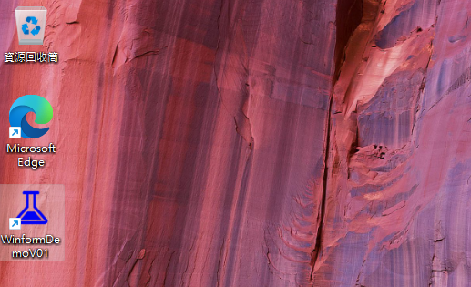
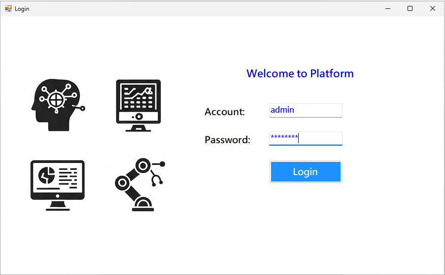
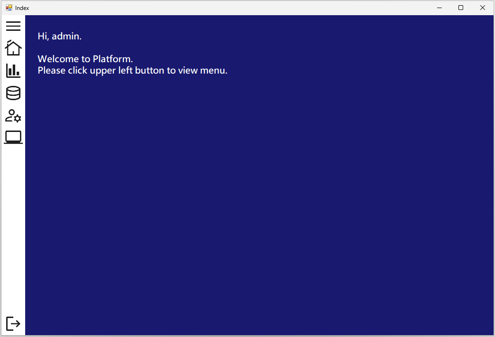
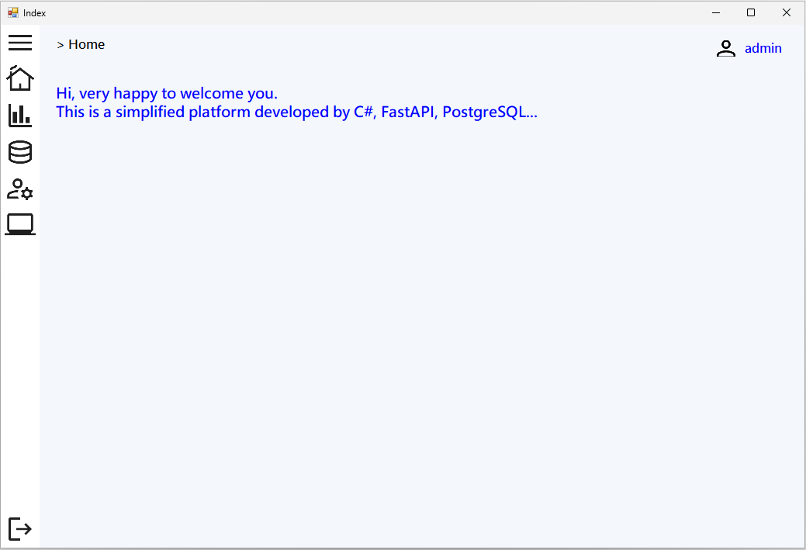
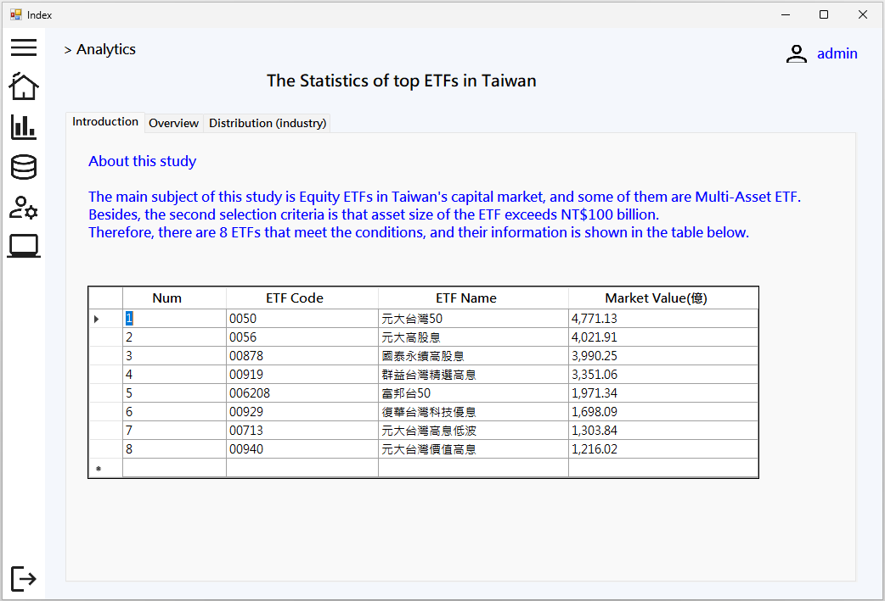
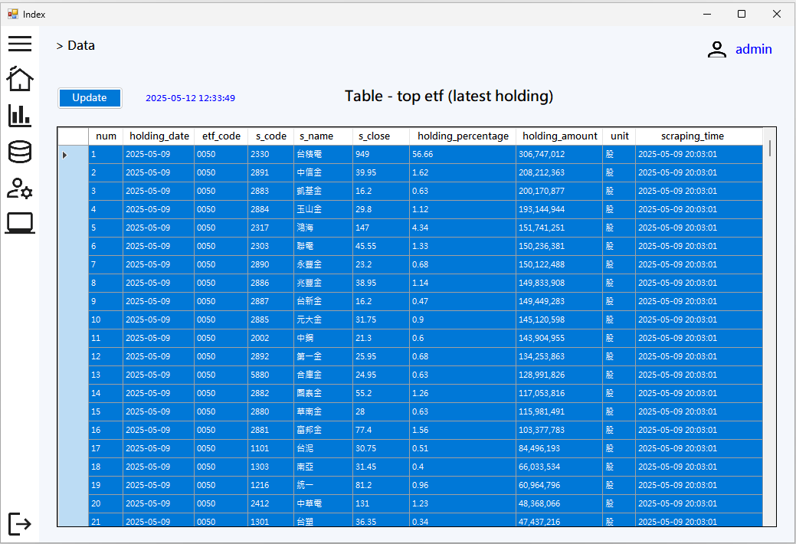
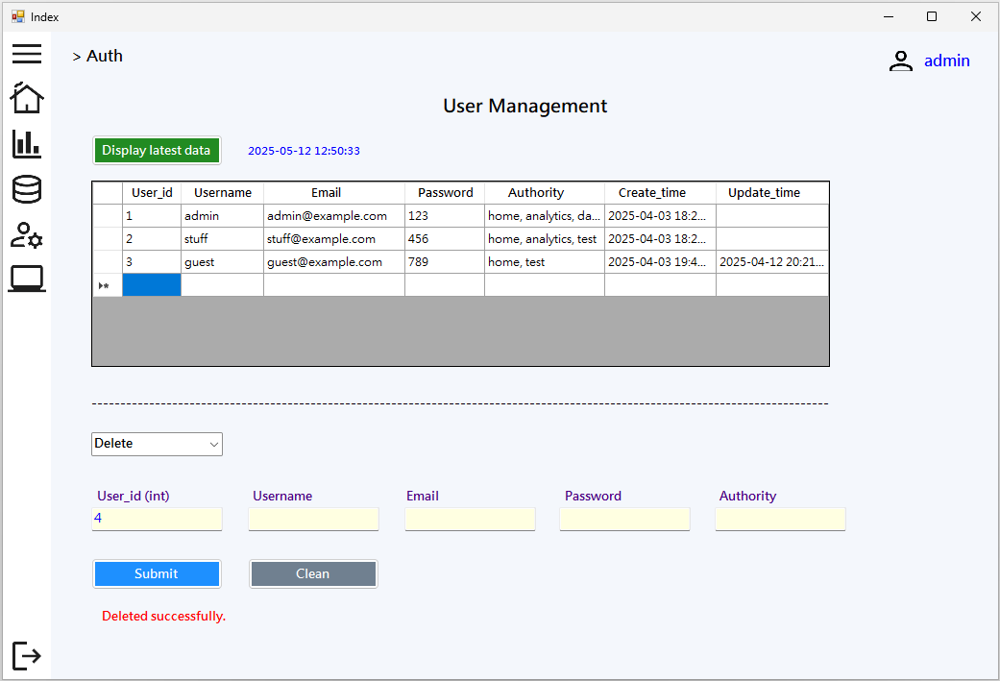

# **c_sharp_winform_v1**

## **Creating a Windows Forms App for investment statistics platform with C#**

### **Ⅰ. Purpose** 

 Although web technology is becoming more and more advanced, there are still many manufacturing companies in Taiwan using C# windows forms to develop and maintain their information management systems, especially ERP related applications. The content of this project is a demo to build a backend platform for the investment statistics of top ETFs in Taiwan mainly with C# Windows Forms App (.NET Framework)   

### **Ⅱ. Tools**

Front-End: C# Windows Forms App (.NET Framework 4.8)   
Back-End: FastAPI, PostgreSQL  
Other: Selenium, Beautiful Soup, Docker, n8n  
 

### **Ⅲ. Statement** 

__1. The main components of this website__  

This Windows Forms App has side-menu with five options. Only 4 options will be explained. 

__● Option -  Home__ 

Just a simple explanation for this windows forms app. 

__● Option - Analytics__ 

Originally, 8 tabs were expected, but they all used the same method, so only 2 are listed for now. If interested, please refer to the project  [[dash_plotly_demo_01](<https://github.com/qinglian1105/dash_plotly_demo_01>)]. 

(1)Tab - Introduction: just a brief description about this study. 
(2)Tab - Overview: a dashboard with metrics, charts. 

__● Option - Data__ 

Just display a table for checking whether data is inserted successfully or completely. 

__● Option - Auth__ 

It's User Management. 

 

__2. Data__  

(1)Source  
Thanks for the website, "https://www.pocket.tw/etf/", provided by Pocket Securities. This company, one of the best Online Brokers in Taiwan, delivers high-quality services to customers, and its website makes it easier for investors to obtain financial data and useful information. 

(2)Web scraping 
The targeted data is the holding details, like stocks, bonds and so on, of exchange-traded fund (ETF) in Taiwan. The ETFs are selected according to the standard that they primarily invest in stocks and their asset value is more than one hundred billion (TWD). Therefore, 8 ETFs are selected in this project. Their security codes are '0050', '00878', '0056', '00919', '00929', '006208', '00940' and '00713' respectively. 
In addition, the information about ETF ranking by asset value, trading volume and so on, in Taiwan can be read on the website, Yahoo Finance (Taiwan). (Please refer to [details](<https://tw.stock.yahoo.com/tw-etf/total-assets>)) 
Besides, web scraping is primarily implemented by "Selenium" and "Beautiful Soup", and then data is saved into database. These tasks are built in a workflow by "n8n", as the workflow of ETF tools like Airflow or DolphineScheduler, scheduling and monitoring task execution. As you can see below. 

  

__3. How programming works__  

This windows forms app is built in three parts. 
(1)C# is charge of creating windows forms and calling backend APIs for user interface. Finally, the programming will be packaged into EXE file for installing and then generate an icon for starting. 
(2)FastAPI gets data from the database, PostgreSQL, and then processes the figures for metrics, charts, and tables. (Please refer the project  [[dash_plotly_demo_01](<https://github.com/qinglian1105/dash_plotly_demo_01>)]) 
(3)The workflow of n8n, as just mentioned, operates periodically for crawling data from the website and saving data into database. The node "Gmail" in workflow will inform the results regardless of whether the workflow executed successfully or not.(Please refer to the similar project  [[n8n_py_js_demo_01](<https://github.com/qinglian1105/n8n_py_js_demo_01>)]) 

 

__4. Results__  

__● Start Icon__  

As shown in below picture, there is an icon "WinformDemoV01" on the desk of Windows 11 for starting the programming. 

  

__● Form - Login & Logout__  

Form - Login 

  

Form - Index: it would exhibit side menu and content area after logging. 

  

Form - Index (with menu): click upper left button to open and view items in the menu. 

  

After clicking lower left button "Logout", it would display the message box for confirmation to logout. 

  

__● Form - Home__  

Form - Home: as mentioned above. 

  

__● Option - Analytics__  

This option, namely Form - Analytics, is the statistics of top equity ETFs in Taiwan. 

(1)Tab - Introduction: as mentioned above. 

  

(2)Tab - Overview: a dashboard has a date picker to choose date for metrics and charts. 

  

__● Option - Data__  

This form would display the status, including record counts and lastest records, in main tables of database, invest.  

  

__● Option - Auth__  

This form is about user management. Only authorized personnel can add new users, remove users, update information of users. Besides, Using 'Update' to revise the content of coloum 'Authority' can control users for accessible pages.  

  

Below tht table, the Drop-down list provides three actions, including Create, Update, and Delete, for operating database. For example, the picture shows that an new user, qqco, was created.

  

Then, action 'Update' can be used to revise information, like Email, Password, and Authority, of the user.

  

After new adding this user, he or she can login to this platform for viewing the content.

  

However, he or she can be allowed to access several pages, like home and test.

  

Of course, this record can be removed by the action - Delete.

  

__The above offers backend platform presented in windows forms with C#, FastAPI and n8n for investment statistics.__  

 

---

### **Ⅳ. References**

[1] [使用 C# 在 Visual Studio 中建立 Windows Forms 應用程式](<https://learn.microsoft.com/zh-tw/visualstudio/ide/create-csharp-winform-visual-studio?view=vs-2022>)

[2] [Google Fonts](<https://fonts.google.com/>)

[3] [n8n](<https://n8n.io/>)

[4] [qinglian1105/dash_plotly_demo_01](<https://github.com/qinglian1105/dash_plotly_demo_01>)

[5] [Yahoo Finance(Taiwan) - ETF asset ranking](<https://tw.stock.yahoo.com/tw-etf/total-assets>)

[6] [Pocket Securities - ETF](<https://www.pocket.tw/etf/>)

